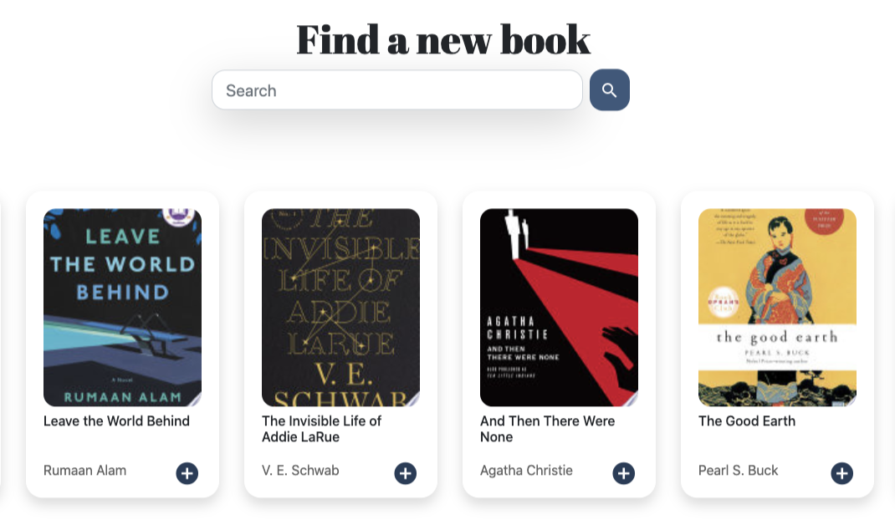
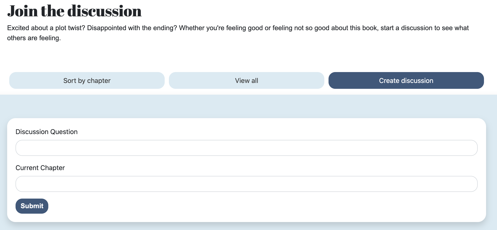

# Book_Chat
## Description
This application was created for book lovers to have to ability to share thoughts and comments on a book or books they're reading without having to meet in person. Users are able to join Book Clubs and discussions related to the book(s) that the user is reading. 

Use the following link to access the application: https://book--chat.herokuapp.com/

## Usage
* Create a new account
* Log onto Book Chat 
* Search for a book or books that you are reading
* Add book(s) to your favorites 
* Join or start a discussion about the book. 

## Technologies Used
```Bootstrap, JavaScript, jQuery, Google Books API, Sequelize ORM ```

## Images




## Contributing
Kevin Connell, Andrew Bretnall, Alberte Laventure

## License
[](https://opensource.org/licenses/MIT)

